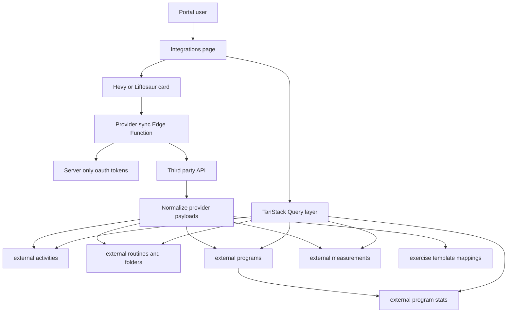
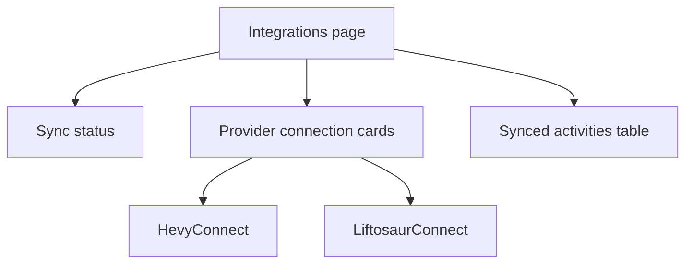
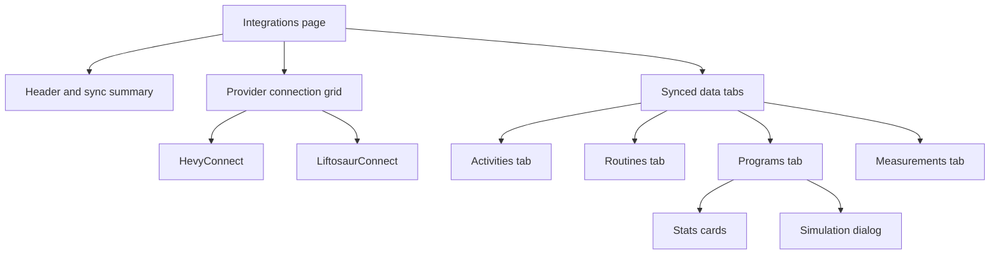

# API Feature Analysis Web Portal Technical Roadmap

## Scope Boundary

This roadmap is restricted to the web portal infrastructure in this repository. It intentionally excludes mobile application endpoint routing, client DTO updates, local persistence, and mobile state management, even where the source analysis document mentions them.

Primary evidence sources:

- [`API Feature Analysis.pdf`](./api-feature-analysis.pdf)
- [`src/app/components/Integrations.tsx`](../src/app/components/Integrations.tsx)
- [`src/app/components/integrations/HevyConnect.tsx`](../src/app/components/integrations/HevyConnect.tsx)
- [`src/app/components/integrations/LiftosaurConnect.tsx`](../src/app/components/integrations/LiftosaurConnect.tsx)
- [`src/queries/integrations.ts`](../src/queries/integrations.ts)
- [`src/mutations/integrations.ts`](../src/mutations/integrations.ts)
- [`supabase/functions/hevy-sync/index.ts`](../supabase/functions/hevy-sync/index.ts)
- [`supabase/functions/liftosaur-sync/index.ts`](../supabase/functions/liftosaur-sync/index.ts)
- [`supabase/migrations/20260216_integrations.sql`](../supabase/migrations/20260216_integrations.sql)
- [`supabase/migrations/20260503000000_exercise_catalog.sql`](../supabase/migrations/20260503000000_exercise_catalog.sql)

## Current Portal Architecture Snapshot

The portal is a React and Supabase application with:

- App bootstrap through [`src/main.tsx`](../src/main.tsx), wrapping routes in [`QueryProvider`](../src/providers/QueryProvider.tsx) and [`AuthProvider`](../src/providers/AuthProvider.tsx).
- Protected app shell in [`AppLayout`](../src/app/routes/AppLayout.tsx), with route definitions in [`src/app/routes/index.tsx`](../src/app/routes/index.tsx).
- Integrations route at [`/integrations`](../src/app/routes/index.tsx), gated behind the `FLAME` subscription tier by [`SubscribedRoute`](../src/app/routes/SubscribedRoute.tsx).
- Integration UI composed by [`Integrations`](../src/app/components/Integrations.tsx), provider connection cards, and a single activity table [`ExternalActivityList`](../src/app/components/integrations/ExternalActivityList.tsx).
- Portal data fetching through TanStack Query using [`queryKeys`](../src/queries/keys.ts), [`integrationsOptions`](../src/queries/integrations.ts), and [`externalActivitiesOptions`](../src/queries/integrations.ts).
- Backend integration state in [`user_integrations`](../supabase/migrations/20260216_integrations.sql), sync queue state in [`sync_queue`](../supabase/migrations/20260216_integrations.sql), and imported workout history in [`external_activities`](../supabase/migrations/20260216_integrations.sql).
- Sensitive provider keys isolated in [`oauth_tokens`](../supabase/migrations/20260227_oauth_security.sql), accessed only by service-role Edge Functions.
- Hevy and Liftosaur sync currently implemented as direct provider-specific Edge Functions: [`hevy-sync`](../supabase/functions/hevy-sync/index.ts) and [`liftosaur-sync`](../supabase/functions/liftosaur-sync/index.ts).

## Architectural Gap Summary

| Capability | Current Portal State | Required Web Portal Change |
| --- | --- | --- |
| Hevy workout imports | [`hevy-sync`](../supabase/functions/hevy-sync/index.ts) imports `GET /v1/workouts` into [`external_activities`](../supabase/migrations/20260216_integrations.sql). | Add incremental event handling through `GET /v1/workouts/events`, preserve update and deletion semantics, and expose richer sync summaries. |
| Hevy routines | No portal storage, query, or UI for external routines. | Add external routine and folder schema, sync ingestion, queries, and UI browser. |
| Hevy routine folders | No references to `/routine_folders`. | Store folder metadata and group imported Hevy routines by folder. |
| Hevy exercise templates | Portal has [`exercise_catalog`](../supabase/migrations/20260503000000_exercise_catalog.sql), but no Hevy template mapping/cache. | Add provider exercise template mapping table and import logic to enrich Hevy workouts and routines. |
| Hevy body measurements | No integration-specific measurement schema or UI. | Add body measurement table, sync ingestion, and portal visualization in integrations or analytics. |
| Liftosaur history | [`liftosaur-sync`](../supabase/functions/liftosaur-sync/index.ts) imports `/history` into [`external_activities`](../supabase/migrations/20260216_integrations.sql). | Retain history import and expand response summary to include programs and stats counts. |
| Liftosaur programs | No portal storage, query, or UI for programs. | Add external program schema, program detail ingestion, current-program flag, and UI browser. |
| Liftosaur program stats | No `program-stats` calls or storage. | Add program stats table, sync ingestion, and UI cards/charts. |
| Liftosaur playground | No portal endpoint or UI simulation. | Add secure Edge Function proxy and portal simulation dialog for stored programs. |
| Subscription error flags | Hevy uses `requires_pro`; Liftosaur uses `requires_premium`; portal toasts are provider-specific. | Normalize portal Edge Function response to a shared `requiresUpgrade` field while keeping compatibility aliases during migration. |
| Manual sync providers | [`MANUAL_SYNC_PROVIDERS`](../src/mutations/integrations.ts) omits `liftosaur`. | Include `liftosaur` and invalidate new external data query keys after sync. |
| Type generation | [`database.types.ts`](../src/lib/database.types.ts) has no external programs, routines, folders, measurements, templates, or stats. | Regenerate/update Supabase types after migration. |

## Target Data Flow

## Proposed Database Changes

Create one idempotent migration under [`supabase/migrations/`](../supabase/migrations/) after the latest timestamp, for example `20260518_external_training_integrations.sql`.

### New Tables

1. `external_routine_folders`
   - `id uuid primary key default gen_random_uuid()`
   - `user_id uuid not null references auth.users(id) on delete cascade`
   - `provider text not null check (provider in ('hevy'))`
   - `external_id text not null`
   - `title text not null`
   - `folder_index int`
   - `raw_data jsonb not null default '{}'`
   - `created_at timestamptz not null default now()`
   - `updated_at timestamptz not null default now()`
   - `synced_at timestamptz not null default now()`
   - unique key on `(user_id, provider, external_id)`

2. `external_routines`
   - `id uuid primary key default gen_random_uuid()`
   - `user_id uuid not null references auth.users(id) on delete cascade`
   - `provider text not null check (provider in ('hevy'))`
   - `external_id text not null`
   - `folder_external_id text`
   - `folder_id uuid references external_routine_folders(id) on delete set null`
   - `name text not null`
   - `description text`
   - `exercise_count int not null default 0`
   - `set_count int not null default 0`
   - `estimated_duration_seconds int`
   - `provider_updated_at timestamptz`
   - `raw_data jsonb not null default '{}'`
   - `created_at timestamptz not null default now()`
   - `updated_at timestamptz not null default now()`
   - `synced_at timestamptz not null default now()`
   - unique key on `(user_id, provider, external_id)`

3. `external_programs`
   - `id uuid primary key default gen_random_uuid()`
   - `user_id uuid not null references auth.users(id) on delete cascade`
   - `provider text not null check (provider in ('liftosaur'))`
   - `external_id text not null`
   - `name text not null`
   - `is_current boolean not null default false`
   - `script_text text`
   - `raw_data jsonb not null default '{}'`
   - `created_at timestamptz not null default now()`
   - `updated_at timestamptz not null default now()`
   - `synced_at timestamptz not null default now()`
   - unique key on `(user_id, provider, external_id)`

4. `external_program_stats`
   - `id uuid primary key default gen_random_uuid()`
   - `program_id uuid not null references external_programs(id) on delete cascade`
   - `user_id uuid not null references auth.users(id) on delete cascade`
   - `provider text not null check (provider in ('liftosaur'))`
   - `days int`
   - `approx_minutes int`
   - `set_count int`
   - `muscle_group_breakdown jsonb not null default '{}'`
   - `raw_data jsonb not null default '{}'`
   - `computed_at timestamptz not null default now()`
   - unique key on `(program_id)`

5. `external_body_measurements`
   - `id uuid primary key default gen_random_uuid()`
   - `user_id uuid not null references auth.users(id) on delete cascade`
   - `provider text not null check (provider in ('hevy'))`
   - `external_id text not null`
   - `measurement_type text not null`
   - `value numeric not null`
   - `unit text`
   - `measured_at timestamptz not null`
   - `raw_data jsonb not null default '{}'`
   - `created_at timestamptz not null default now()`
   - `updated_at timestamptz not null default now()`
   - `synced_at timestamptz not null default now()`
   - unique key on `(user_id, provider, external_id)`

6. `external_exercise_templates`
   - `id uuid primary key default gen_random_uuid()`
   - `provider text not null check (provider in ('hevy'))`
   - `external_id text not null`
   - `title text not null`
   - `template_type text`
   - `primary_muscle_groups text[] not null default '{}'`
   - `secondary_muscle_groups text[] not null default '{}'`
   - `is_custom boolean not null default false`
   - `exercise_catalog_id text references exercise_catalog(id) on delete set null`
   - `raw_data jsonb not null default '{}'`
   - `created_at timestamptz not null default now()`
   - `updated_at timestamptz not null default now()`
   - unique key on `(provider, external_id)`

### Indexes

Add indexes for portal query paths:

- `idx_external_routines_user_provider` on `(user_id, provider)`
- `idx_external_routines_folder` on `(folder_id)`
- `idx_external_programs_user_provider` on `(user_id, provider)`
- `idx_external_programs_current` on `(user_id, provider, is_current)` where `is_current = true`
- `idx_external_measurements_user_type_date` on `(user_id, measurement_type, measured_at desc)`
- `idx_external_exercise_templates_title` on `lower(title)`

### RLS and Grants

Use the existing pattern from [`external_activities`](../supabase/migrations/20260216_integrations.sql):

- Authenticated users may `select` their own rows from user-scoped tables.
- Authenticated users should not directly insert/update/delete externally synced tables unless a CSV import path requires it.
- Service role has full access for Edge Functions.
- `external_exercise_templates` may be readable by authenticated users globally when not user-specific.

### Type Updates

After migration, regenerate or update [`src/lib/database.types.ts`](../src/lib/database.types.ts). The implementation should not hand-edit unrelated generated sections.

## Backend Edge Function Roadmap

### Shared Backend Utilities

Add a shared provider helper module, for example [`supabase/functions/_shared/providerSync.ts`](../supabase/functions/_shared/providerSync.ts), to avoid duplicating logic already present in [`hevy-sync`](../supabase/functions/hevy-sync/index.ts) and [`liftosaur-sync`](../supabase/functions/liftosaur-sync/index.ts):

- Authenticate request as browser JWT or service role.
- Resolve provider API key from [`oauth_tokens`](../supabase/migrations/20260227_oauth_security.sql).
- Normalize upgrade errors to `{ requiresUpgrade: true, provider, requiredPlan, error }`.
- Provide paginated fetch helpers with max page limits.
- Update [`sync_queue`](../supabase/migrations/20260216_integrations.sql) by targeted queue row if request includes a `sync_queue_id`, avoiding broad updates by user and provider.

### Hevy Sync Expansion

Modify [`supabase/functions/hevy-sync/index.ts`](../supabase/functions/hevy-sync/index.ts):

1. Keep API key storage behavior unchanged.
2. Replace single workout fetch with staged sync:
   - `GET /v1/workouts/events?since=<last_sync_at>` when `last_sync_at` exists.
   - Fall back to paginated `GET /v1/workouts` for initial sync.
   - For updated workout event IDs, fetch `GET /v1/workouts/{workoutId}` and upsert into [`external_activities`](../supabase/migrations/20260216_integrations.sql).
   - For deleted workout event IDs, delete or soft-delete matching `external_activities` rows. If soft-delete is preferred, add `deleted_at` to [`external_activities`](../supabase/migrations/20260216_integrations.sql).
3. Add Hevy routines sync:
   - Fetch `GET /v1/routine_folders` into `external_routine_folders`.
   - Fetch paginated `GET /v1/routines`, and optionally `GET /v1/routines/{id}` for complete details if list payload is abbreviated.
   - Upsert into `external_routines` with folder relationship resolution by external folder ID.
4. Add exercise template cache:
   - Fetch `GET /v1/exercise_templates` with pagination or search defaults.
   - Upsert into `external_exercise_templates`.
   - Map template titles to [`exercise_catalog`](../supabase/migrations/20260503000000_exercise_catalog.sql) by normalized title and aliases where possible.
5. Add body measurements sync:
   - Either include `GET /v1/body_measurements` in `hevy-sync`, or create a focused [`hevy-measurements-sync`](../supabase/functions/hevy-measurements-sync/index.ts).
   - Prefer including it in `hevy-sync` for a single user-triggered sync summary unless API latency proves too high.
6. Return summary fields:
   - `importedActivities`
   - `updatedActivities`
   - `deletedActivities`
   - `importedRoutines`
   - `importedFolders`
   - `importedTemplates`
   - `importedMeasurements`
   - `requiresUpgrade`

### Liftosaur Sync Expansion

Modify [`supabase/functions/liftosaur-sync/index.ts`](../supabase/functions/liftosaur-sync/index.ts):

1. Retain existing paginated history import from `/history`.
2. Add program sync:
   - `GET /api/v1/programs` for program list.
   - `GET /api/v1/programs/{id}` for each program detail and script text.
   - Upsert into `external_programs`, preserving `isCurrent` as `is_current`.
3. Add stats sync:
   - For each program with script text, call `POST /api/v1/program-stats`.
   - Store results in `external_program_stats`.
   - Continue syncing other programs if stats fails for one program, but record partial errors in sync response and `user_integrations.error_message` only if critical.
4. Normalize access-denied response to `requiresUpgrade` while maintaining `requires_premium` for existing UI compatibility during transition.
5. Return summary fields:
   - `importedActivities`
   - `importedPrograms`
   - `importedProgramStats`
   - `currentProgramId`
   - `partialErrors`
   - `requiresUpgrade`

### Liftosaur Playground Proxy

Create [`supabase/functions/liftosaur-playground/index.ts`](../supabase/functions/liftosaur-playground/index.ts):

- Authenticate browser JWT and require `FLAME` through [`requireSubscription`](../supabase/functions/_shared/requireSubscription.ts).
- Accept `{ programId, commands }` where `programId` refers to `external_programs.id` owned by the user.
- Load stored `script_text` server-side rather than trusting a full script from the browser.
- Forward to `POST /api/v1/playground` with the stored API key.
- Return preview result to the portal.
- If the command finishes a workout and the provider returns updated program text, update `external_programs.script_text` and refresh `external_program_stats`.

### Sync Queue Processor

Update [`process-sync-queue`](../supabase/functions/process-sync-queue/index.ts):

- Ensure `liftosaur` remains in provider list and rate limits.
- Pass `sync_queue_id` when invoking provider sync functions.
- Consider provider-specific sync types, such as `programs`, `routines`, `measurements`, and `full`, in `sync_queue.sync_type`.

## Frontend Roadmap

### Query Layer

Modify [`src/queries/keys.ts`](../src/queries/keys.ts):

- Add `externalRoutines(userId, provider?)`.
- Add `externalRoutineFolders(userId)`.
- Add `externalPrograms(userId, provider?)`.
- Add `externalProgramStats(userId, programId?)`.
- Add `externalMeasurements(userId, type?)`.
- Add `externalExerciseTemplates(provider, search?)`.

Modify [`src/queries/integrations.ts`](../src/queries/integrations.ts):

- Add query options for all new external entities.
- Keep results limited and sorted for portal performance.
- Parse results with new Zod schemas rather than returning unvalidated `data` where practical.

Create [`src/schemas/integrations.ts`](../src/schemas/integrations.ts):

- `externalRoutineSchema`
- `externalRoutineFolderSchema`
- `externalProgramSchema`
- `externalProgramStatsSchema`
- `externalBodyMeasurementSchema`
- `integrationSyncSummarySchema`

Update [`src/lib/integrations/types.ts`](../src/lib/integrations/types.ts):

- Add typed interfaces matching the new external entity rows.
- Add sync summary type with unified `requiresUpgrade`.
- Add provider metadata for feature support: `supportsRoutines`, `supportsPrograms`, `supportsMeasurements`, `supportsPlayground`.

### Mutations

Modify [`src/mutations/integrations.ts`](../src/mutations/integrations.ts):

- Add `liftosaur` to `MANUAL_SYNC_PROVIDERS`.
- Invalidate new query keys for routines, programs, stats, folders, measurements, and templates after sync or disconnect.
- Add `useLiftosaurPlayground()` mutation for the new Edge Function.
- Consider `useProviderFeatureSync()` for targeted sync buttons, but avoid over-abstracting before UI behavior stabilizes.

### Component Hierarchy

Current hierarchy:

Target hierarchy:

Modify [`src/app/components/Integrations.tsx`](../src/app/components/Integrations.tsx):

- Replace the single `Synced Activities` section with tabbed sections using existing [`Tabs`](../src/app/components/ui/tabs.tsx).
- Load activities, routines, programs, measurements, and stats through parallel queries.
- Show provider-level count badges, for example `3 routines`, `2 programs`, `12 measurements`.
- Keep the portal-only scope clear by not rendering mobile-only sync details beyond existing mobile provider cards.

Update [`HevyConnect`](../src/app/components/integrations/HevyConnect.tsx):

- Display returned sync summary counts after save or test.
- Replace `requires_pro` handling with `requiresUpgrade`, while temporarily supporting `requires_pro`.
- Add explanatory copy for API-imported routines, folders, templates, and measurements.
- Invalidate new integration query keys after API sync.

Update [`LiftosaurConnect`](../src/app/components/integrations/LiftosaurConnect.tsx):

- Display returned imported program and stats counts.
- Replace `requires_premium` handling with `requiresUpgrade`, while temporarily supporting `requires_premium`.
- Add a connected-state summary for current program.
- Invalidate new integration query keys after API sync.

Add components under [`src/app/components/integrations/`](../src/app/components/integrations/):

- `ExternalRoutineList.tsx`
- `ExternalProgramList.tsx`
- `ExternalProgramStatsCard.tsx`
- `ExternalMeasurementChart.tsx`
- `LiftosaurPlaygroundDialog.tsx`
- `IntegrationFeatureSummary.tsx`

### Navigation

No new top-level route is required initially. Keep all new provider data inside [`/integrations`](../src/app/routes/index.tsx) to minimize routing and scope. A future dedicated `External Programs` route can be considered only after the integrations page becomes too dense.

## Rollout Phases

1. Schema foundation
   - Add new migration for external folders, routines, programs, stats, measurements, and templates.
   - Add RLS policies, indexes, grants, and generated types.

2. Backend ingestion
   - Refactor shared provider auth and response helpers.
   - Extend [`hevy-sync`](../supabase/functions/hevy-sync/index.ts).
   - Extend [`liftosaur-sync`](../supabase/functions/liftosaur-sync/index.ts).
   - Add [`liftosaur-playground`](../supabase/functions/liftosaur-playground/index.ts).
   - Update [`process-sync-queue`](../supabase/functions/process-sync-queue/index.ts).

3. Frontend data layer
   - Add schemas, types, query keys, query options, and mutation invalidation.
   - Update integration sync response handling.

4. Frontend UI
   - Add tabbed integrations page sections.
   - Add lists, stats cards, measurement chart, and playground dialog.
   - Update provider cards and connection components with richer sync summaries.

5. Validation and hardening
   - Add unit tests for query options and sync response parsing.
   - Add Edge Function tests or harness tests for successful sync, upgrade gating, partial failure, pagination limits, and deletion events.
   - Add component tests for new integrations tabs and empty states.
   - Run [`npm run verify:full`](../package.json) and [`npm run test:sync`](../package.json) for sync-adjacent work.

## Testing Strategy

- Query tests in [`src/queries/__tests__/`](../src/queries/__tests__/) for new integration query options.
- Component tests in [`src/app/components/__tests__/`](../src/app/components/__tests__/) for the tabbed integrations page and feature summaries.
- Edge Function security regression tests in [`tests/security/edge-function-security.test.ts`](../tests/security/edge-function-security.test.ts) for [`liftosaur-playground`](../supabase/functions/liftosaur-playground/index.ts).
- Sync tests in [`tests/sync/`](../tests/sync/) for new external entity payloads where they intersect sync infrastructure.
- Migration validation with idempotent SQL and RLS access checks.

## Risks and Mitigations

- Provider API shape uncertainty: persist full raw payloads and isolate mappers behind small normalization functions.
- Long-running syncs: page with hard limits, store partial progress, and return partial summary instead of failing the whole sync when non-critical enrichment fails.
- RLS leakage: default to read-own rows only and service-role-only writes for provider-ingested data.
- Existing UI assumptions: keep [`ExternalActivityList`](../src/app/components/integrations/ExternalActivityList.tsx) stable and add new tabs alongside it instead of replacing the table outright.
- Response compatibility: keep provider-specific flags during one transition while adding `requiresUpgrade`.
- Exercise template mapping quality: begin with deterministic normalized-name matching to [`exercise_catalog`](../supabase/migrations/20260503000000_exercise_catalog.sql), and store unmatched templates for later manual or heuristic mapping.

## Implementation Checklist

- [ ] Create idempotent migration for new external integration tables, indexes, RLS, and grants.
- [ ] Regenerate or update [`src/lib/database.types.ts`](../src/lib/database.types.ts) after schema changes.
- [ ] Add integration schemas in [`src/schemas/integrations.ts`](../src/schemas/integrations.ts).
- [ ] Expand integration types in [`src/lib/integrations/types.ts`](../src/lib/integrations/types.ts).
- [ ] Add new query keys in [`src/queries/keys.ts`](../src/queries/keys.ts).
- [ ] Add query options in [`src/queries/integrations.ts`](../src/queries/integrations.ts).
- [ ] Update manual sync provider support and invalidation in [`src/mutations/integrations.ts`](../src/mutations/integrations.ts).
- [ ] Add shared provider sync helpers under [`supabase/functions/_shared/`](../supabase/functions/_shared/).
- [ ] Extend [`hevy-sync`](../supabase/functions/hevy-sync/index.ts) for events, routines, folders, templates, and measurements.
- [ ] Extend [`liftosaur-sync`](../supabase/functions/liftosaur-sync/index.ts) for programs and program stats.
- [ ] Add [`liftosaur-playground`](../supabase/functions/liftosaur-playground/index.ts).
- [ ] Update [`process-sync-queue`](../supabase/functions/process-sync-queue/index.ts) for targeted queue processing and expanded sync summaries.
- [ ] Add new integration list, chart, stats, and dialog components under [`src/app/components/integrations/`](../src/app/components/integrations/).
- [ ] Update [`Integrations`](../src/app/components/Integrations.tsx) to render tabbed external data sections.
- [ ] Update [`HevyConnect`](../src/app/components/integrations/HevyConnect.tsx) for richer sync summaries and unified upgrade handling.
- [ ] Update [`LiftosaurConnect`](../src/app/components/integrations/LiftosaurConnect.tsx) for richer sync summaries and unified upgrade handling.
- [ ] Add query, component, Edge Function, and migration/RLS tests.
- [ ] Validate with [`npm run verify:full`](../package.json) and [`npm run test:sync`](../package.json).
